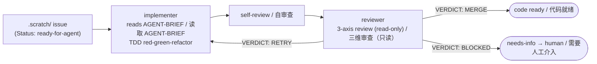

# opencode-toolbox

[](https://www.npmjs.com/package/@MatthewYe/opencode-toolbox)
[](LICENSE)
[](https://bun.sh)

Autopilot agent cluster for [opencode](https://github.com/anomalyco/opencode) — autonomous feature kit with TDD discipline.

基于 [opencode](https://github.com/anomalyco/opencode) 的自动驾驶 agent 集群 —— 遵循 TDD 纪律的自主开发工具包。

## Why / 为什么

OpenCode is powerful, but out of the box it's a single-turn assistant — you prompt, it responds, context vanishes. Turning a feature from idea to merged code takes dozens of manual rounds and constant babysitting.

OpenCode 很强大，但开箱即用只是单轮助手 —— 你提问、它回答，上下文随之消失。把一个功能从想法变成合入代码，需要几十轮手动交互和持续的盯盘。

**opencode-toolbox** fills that gap: a structured autopilot workflow that takes a well-specified issue in `.scratch/`, dispatches a TDD-driven implementer agent, runs it through a reviewer, and loops until the code is ready to merge — all autonomous, all with clear reports you can audit at any point.

**opencode-toolbox** 填补了这个空白：结构化的自动驾驶工作流，从 `.scratch/` 目录中取出一个充分定义好的 issue，派遣 TDD 驱动的 implementer agent，经过 reviewer 审查，循环直到代码可以合入 —— 全程自主运行，每步都有清晰可审计的报告。

Built on top of [mattpocock/skills](https://github.com/mattpocock/skills) and extended with personal additions from heavy daily use.

基于 [mattpocock/skills](https://github.com/mattpocock/skills) 构建，并根据日常深度使用中的个人习惯做了补充扩展。

## What You Get / 能力一览

| Capability / 能力 | Description / 说明 |
|-------------------|-------------------|
| `/autopilot` autonomous workflow / 自主开发工作流 | TDD-driven implementer → reviewer closed loop, up to 3 retry rounds / TDD 驱动的 implementer → reviewer 闭环，最多 3 轮重试 |
| Engineering skills / 工程技能 | `tdd`, `diagnose`, `triage`, `to-issues`, `to-prd`, `zoom-out`, `grill-with-docs`, `improve-codebase-architecture`, `prototype`, `setup-matt-pocock-skills` |
| Productivity skills / 生产力技能 | `caveman` (ultra-compact mode / 极简模式), `grill-me` (design interrogation / 方案拷问), `handoff` (agent context transfer / 上下文交接), `write-a-skill` |
| Custom skills / 自研技能 | `skill-creator` (eval-driven skill development / 评测驱动的技能开发), `opencode-plugin-scaffold` (create/fix OpenCode plugins / 创建修复插件) |
| Agent pair / Agent 对 | `implementer` (TDD execution / TDD 实施) + `reviewer` (3-axis review: Behavior, TDD discipline, Code quality / 三维审查) |

## Prerequisites / 前置条件

- [OpenCode](https://github.com/anomalyco/opencode) CLI installed / 已安装 OpenCode CLI
- [Bun](https://bun.sh) (for local plugin development; not needed for consumption via npm) / 本地插件开发需要；通过 npm 消费则不需要
- Familiarity with the `.scratch/` issue structure / 熟悉 `.scratch/` issue 目录结构 (see / 详见 [AGENTS.md](AGENTS.md))

## Install / 安装

Add to your `opencode.json` or `opencode.jsonc` / 添加到你的 `opencode.json` 或 `opencode.jsonc`：

```json
{ "plugin": ["@MatthewYe/opencode-toolbox"] }
```

Or from a local path / 或使用本地路径：

```json
{ "plugin": ["/path/to/opencode-toolbox"] }
```

The plugin auto-registers skills, agents, and the `/autopilot` command. No symlinks or manual config merging needed.

插件自动注册 skills、agents 和 `/autopilot` 命令。无需 symlink 或手动合并配置。

## Getting Started in 5 Minutes / 五分钟上手

Here's the full pipeline — idea to ready-for-agent — using the skills bundled in this toolbox:

完整流水线 —— 从想法到 ready-for-agent —— 使用本工具箱内置的技能：

```bash
# 1. Grill — stress-test your idea against domain docs and decisions
#    拷问 —— 对照领域文档和决策记录，压力测试你的想法
/grill-with-docs "Add user authentication with OAuth"

# 2. Spec — crystallize the outcome into a PRD
#    规格化 —— 将结论固化为 PRD
/to-prd

# 3. Slice — break the PRD into independently-grabbable issues
#    切片 —— 将 PRD 拆分为可独立领取的 issues
/to-issues

# 4. Triage — walk each issue through the state machine to ready-for-agent
#    分流 —— 将每个 issue 走完状态机，推进到 ready-for-agent
/triage
```

Once issues are `Status: ready-for-agent` / 当 issue 状态为 `ready-for-agent` 后：

```bash
# 5. Autopilot — implementer → reviewer, autonomous TDD loop
#    自动驾驶 —— implementer → reviewer，自主 TDD 循环
/autopilot                          # Process first ready issue / 处理第一个就绪 issue
/autopilot .scratch/feat/issues/01-add-login  # Process a specific one / 处理指定 issue
```

## Architecture / 架构



**Reports** are machine-parsable — the orchestrator reads `IMPLEMENTER_REPORT:` and `REVIEWER_REPORT:` blocks to decide next steps.

**报告**可被机器解析 —— 编排器读取 `IMPLEMENTER_REPORT:` 和 `REVIEWER_REPORT:` 块来决定下一步。

Max **3 rounds** (initial + 2 retries). If RETRY on round 3, the issue goes to `needs-info` for human triage.

最多 **3 轮**（初始 + 2 次重试）。若第 3 轮仍 RETRY，issue 进入 `needs-info` 等待人工处理。

For full details on issue structure, TDD discipline rules, and agent behavior, see [AGENTS.md](AGENTS.md).

关于 issue 结构、TDD 纪律规则和 agent 行为的完整细节，详见 [AGENTS.md](AGENTS.md)。

## Status & Roadmap / 状态与路线图

**Current / 当前状态**: Stable — used daily in personal workflow. Feature-complete for the autopilot loop.

稳定 —— 每日个人工作流中使用，autopilot 循环功能完备。

**Known limitations / 已知局限**:
- No CI/test suite for the plugin itself (editor-only `tsconfig.json`, no lint/typecheck commands) / 插件自身无 CI/测试套件
- Reviewer is read-only; cannot auto-fix issues it flags / Reviewer 只读，不能自动修复发现的问题
- Only supports the `.scratch/` directory convention for issue storage / 仅支持 `.scratch/` 目录约定的 issue 存储方式

**Next / 下一步**:
- [ ] Issue tracker integration beyond `.scratch/` (GitHub Issues direct dispatch) / 扩展 issue 来源（直接对接 GitHub Issues）
- [ ] Parallel issue processing (dispatch 2+ implementers concurrently) / 并行 issue 处理（同时派遣多个 implementer）

## Contributing / 贡献

See [CONTRIBUTING.md](CONTRIBUTING.md) for environment setup, PR conventions, and the upstream sync policy.

环境搭建、PR 规范和 upstream 同步策略详见 [CONTRIBUTING.md](CONTRIBUTING.md)。

Short version / 简述:
- `bun install && bun run build` to get started / 开始开发
- **Do not modify** files in `upstream/` — they're a squashed subtree of [mattpocock/skills](https://github.com/mattpocock/skills). Upstream changes will be clobbered on next sync. / **不要修改** `upstream/` 中的文件 —— 它们是 mattpocock/skills 的压缩子树，下次同步会覆盖。
- Local skills go in `skills/`, local agents in `agents/`, local commands in `commands/`. / 本地技能放 `skills/`，本地 agent 放 `agents/`，本地命令放 `commands/`。

## Acknowledgments / 致谢

- [mattpocock/skills](https://github.com/mattpocock/skills) — the engineering and productivity skills that form the foundation of this toolbox. Sincere thanks to Matt for pioneering the skill-as-agent-instruction pattern. / 构成本工具箱基础的工程与生产力技能。由衷感谢 Matt 开创了 skill-as-agent-instruction 这一模式。
- [opencode](https://github.com/anomalyco/opencode) — the CLI that made autonomous agent workflows possible. / 让自主 agent 工作流成为可能的 CLI 工具。

## License / 许可证

MIT — see [LICENSE](LICENSE) / 详见 [LICENSE](LICENSE)。
