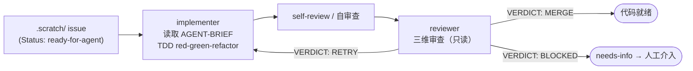

# opencode-toolbox

[](https://www.npmjs.com/package/@MatthewYe/opencode-toolbox)
[](LICENSE)
[](https://bun.sh)

简体中文 | [English](README_en.md)

基于 [opencode](https://github.com/anomalyco/opencode) 的自动驾驶 agent 集群 —— 遵循 TDD 纪律的自主开发工具包。

## 为什么

OpenCode 很强大，但开箱即用只是单轮助手 —— 你提问、它回答，上下文随之消失。把一个功能从想法变成合入代码，需要几十轮手动交互和持续的盯盘。

**opencode-toolbox** 填补了这个空白：结构化的自动驾驶工作流，从 `.scratch/` 目录中取出一个充分定义好的 issue，派遣 TDD 驱动的 implementer agent，经过 reviewer 审查，循环直到代码可以合入 —— 全程自主运行，每步都有清晰可审计的报告。

基于 [mattpocock/skills](https://github.com/mattpocock/skills) 构建，并根据日常深度使用中的个人习惯做了补充扩展。

## 能力一览

| 能力 | 说明 |
|------|------|
| `/autopilot` 自主开发工作流 | TDD 驱动的 implementer → reviewer 闭环，最多 3 轮重试 |
| 工程技能 | `tdd`、`diagnose`、`triage`、`to-issues`、`to-prd`、`zoom-out`、`grill-with-docs`、`improve-codebase-architecture`、`prototype`、`setup-matt-pocock-skills` |
| 生产力技能 | `caveman`（极简模式）、`grill-me`（方案拷问）、`handoff`（上下文交接）、`write-a-skill` |
| 自研技能 | `skill-creator`（评测驱动的技能开发）、`opencode-plugin-scaffold`（创建/修复 OpenCode 插件） |
| Agent 对 | `implementer`（TDD 实施）+ `reviewer`（三维审查：行为对齐、TDD 纪律、代码质量） |

## 前置条件

- 已安装 [OpenCode](https://github.com/anomalyco/opencode) CLI
- [Bun](https://bun.sh)（本地插件开发需要；通过 npm 消费则不需要）
- 熟悉 `.scratch/` issue 目录结构（详见 [AGENTS.md](AGENTS.md)）

## 安装

添加到你的 `opencode.json` 或 `opencode.jsonc`：

```json
{ "plugin": ["@MatthewYe/opencode-toolbox"] }
```

或使用本地路径：

```json
{ "plugin": ["/path/to/opencode-toolbox"] }
```

插件自动注册 skills、agents 和 `/autopilot` 命令。无需 symlink 或手动合并配置。

## 五分钟上手

完整流水线 —— 从想法到 ready-for-agent —— 使用本工具箱内置的技能：

```bash
# 1. 拷问 —— 对照领域文档和决策记录，压力测试你的想法
/grill-with-docs "Add user authentication with OAuth"

# 2. 规格化 —— 将结论固化为 PRD
/to-prd

# 3. 切片 —— 将 PRD 拆分为可独立领取的 issues
/to-issues

# 4. 分流 —— 将每个 issue 走完状态机，推进到 ready-for-agent
/triage
```

当 issue 状态为 `ready-for-agent` 后：

```bash
# 5. 自动驾驶 —— implementer → reviewer，自主 TDD 循环
/autopilot                          # 处理第一个就绪 issue
/autopilot .scratch/feat/issues/01-add-login  # 处理指定 issue
```

## 架构



**报告**可被机器解析 —— 编排器读取 `IMPLEMENTER_REPORT:` 和 `REVIEWER_REPORT:` 块来决定下一步。

最多 **3 轮**（初始 + 2 次重试）。若第 3 轮仍 RETRY，issue 进入 `needs-info` 等待人工处理。

关于 issue 结构、TDD 纪律规则和 agent 行为的完整细节，详见 [AGENTS.md](AGENTS.md)。

## 状态与路线图

**当前状态**：稳定 —— 每日个人工作流中使用，autopilot 循环功能完备。

**已知局限**：
- 插件自身无 CI/测试套件（`tsconfig.json` 仅用于编辑器支持，无 lint/typecheck 命令）
- Reviewer 只读，不能自动修复发现的问题
- 仅支持 `.scratch/` 目录约定的 issue 存储方式

**下一步**：
- [ ] 扩展 issue 来源（直接对接 GitHub Issues）
- [ ] 并行 issue 处理（同时派遣多个 implementer）

## 贡献

环境搭建、PR 规范和 upstream 同步策略详见 [CONTRIBUTING.md](CONTRIBUTING.md)。

简述：
- `bun install && bun run build` 启动开发
- **不要修改** `upstream/` 中的文件 —— 它们是 [mattpocock/skills](https://github.com/mattpocock/skills) 的压缩子树，下次同步会覆盖
- 本地技能放 `skills/`，本地 agent 放 `agents/`，本地命令放 `commands/`

## 致谢

- [mattpocock/skills](https://github.com/mattpocock/skills) —— 构成本工具箱基础的工程与生产力技能。由衷感谢 Matt 开创了 skill-as-agent-instruction 这一模式。
- [opencode](https://github.com/anomalyco/opencode) —— 让自主 agent 工作流成为可能的 CLI 工具。

## 许可证

MIT —— 详见 [LICENSE](LICENSE)。
