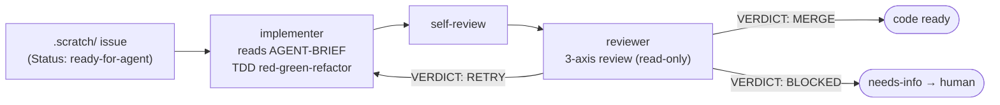

# opencode-toolbox

[](https://www.npmjs.com/package/@MatthewYe/opencode-toolbox)
[](LICENSE)
[](https://bun.sh)

[简体中文](README.md) | English

Autopilot agent cluster for [opencode](https://github.com/anomalyco/opencode) — autonomous feature kit with TDD discipline.

## Why

OpenCode is powerful, but out of the box it's a single-turn assistant — you prompt, it responds, context vanishes. Turning a feature from idea to merged code takes dozens of manual rounds and constant babysitting.

**opencode-toolbox** fills that gap: a structured autopilot workflow that takes a well-specified issue in `.scratch/`, dispatches a TDD-driven implementer agent, runs it through a reviewer, and loops until the code is ready to merge — all autonomous, all with clear reports you can audit at any point.

Built on top of [mattpocock/skills](https://github.com/mattpocock/skills) and extended with personal additions from heavy daily use.

## What You Get

| Capability | Description |
|------------|-------------|
| `/autopilot` autonomous workflow | TDD-driven implementer → reviewer closed loop, up to 3 retry rounds |
| Engineering skills | `tdd`, `diagnose`, `triage`, `to-issues`, `to-prd`, `zoom-out`, `grill-with-docs`, `improve-codebase-architecture`, `prototype`, `setup-matt-pocock-skills` |
| Productivity skills | `caveman` (ultra-compact mode), `grill-me` (design interrogation), `handoff` (agent context transfer), `write-a-skill` |
| Custom skills | `skill-creator` (eval-driven skill development), `opencode-plugin-scaffold` (create/fix OpenCode plugins) |
| Agent pair | `implementer` (TDD execution) + `reviewer` (3-axis review: Behavior, TDD discipline, Code quality) |

## Prerequisites

- [OpenCode](https://github.com/anomalyco/opencode) CLI installed
- [Bun](https://bun.sh) (for local plugin development; not needed for consumption via npm)
- Familiarity with the `.scratch/` issue structure (see [AGENTS.md](AGENTS.md))

## Install

Add to your `opencode.json` or `opencode.jsonc`:

```json
{ "plugin": ["@MatthewYe/opencode-toolbox"] }
```

Or from a local path:

```json
{ "plugin": ["/path/to/opencode-toolbox"] }
```

The plugin auto-registers skills, agents, and the `/autopilot` command. No symlinks or manual config merging needed.

## Getting Started in 5 Minutes

Here's the full pipeline — idea to ready-for-agent — using the skills bundled in this toolbox:

```bash
# 1. Grill — stress-test your idea against domain docs and decisions
/grill-with-docs "Add user authentication with OAuth"

# 2. Spec — crystallize the outcome into a PRD
/to-prd

# 3. Slice — break the PRD into independently-grabbable issues
/to-issues

# 4. Triage — walk each issue through the state machine to ready-for-agent
/triage
```

Once issues are `Status: ready-for-agent`:

```bash
# 5. Autopilot — implementer → reviewer, autonomous TDD loop
/autopilot                          # Process first ready issue
/autopilot .scratch/feat/issues/01-add-login  # Process a specific one
```

## Architecture



**Reports** are machine-parsable — the orchestrator reads `IMPLEMENTER_REPORT:` and `REVIEWER_REPORT:` blocks to decide next steps.

Max **3 rounds** (initial + 2 retries). If RETRY on round 3, the issue goes to `needs-info` for human triage.

For full details on issue structure, TDD discipline rules, and agent behavior, see [AGENTS.md](AGENTS.md).

## Status & Roadmap

**Current**: Stable — used daily in personal workflow. Feature-complete for the autopilot loop.

**Known limitations**:
- No CI/test suite for the plugin itself (editor-only `tsconfig.json`, no lint/typecheck commands)
- Reviewer is read-only; cannot auto-fix issues it flags
- Only supports the `.scratch/` directory convention for issue storage

**Next**:
- [ ] Issue tracker integration beyond `.scratch/` (GitHub Issues direct dispatch)
- [ ] Parallel issue processing (dispatch 2+ implementers concurrently)

## Contributing

See [CONTRIBUTING.md](CONTRIBUTING.md) for environment setup, PR conventions, and the upstream sync policy.

Short version:
- `bun install && bun run build` to get started
- **Do not modify** files in `upstream/` — they're a squashed subtree of [mattpocock/skills](https://github.com/mattpocock/skills). Upstream changes will be clobbered on next sync.
- Local skills go in `skills/`, local agents in `agents/`, local commands in `commands/`.

## Acknowledgments

- [mattpocock/skills](https://github.com/mattpocock/skills) — the engineering and productivity skills that form the foundation of this toolbox. Sincere thanks to Matt for pioneering the skill-as-agent-instruction pattern.
- [opencode](https://github.com/anomalyco/opencode) — the CLI that made autonomous agent workflows possible.

## License

MIT — see [LICENSE](LICENSE).
